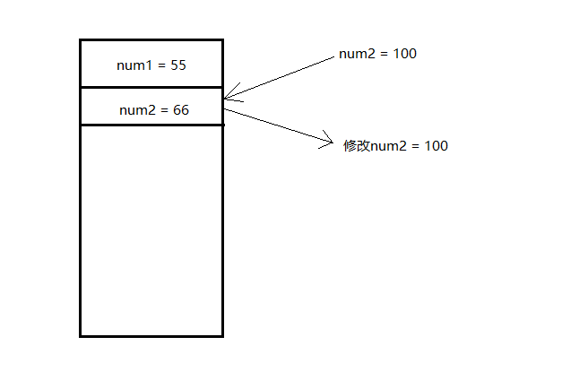

## 作用域和值类型，引用类型的传递

```js
var num1 = 55
var num2 = 66

function fun1(num, num1) {
    // 函数中传递的变量有一个声明的过程因此在 fun1 中会重新声明 num 和 num1 两个变量
    // var num 
    // var num1

    num = 100 // 修改的为函数中的 num
    num1 = 100 // 修改的为函数中的 num1
    num2 = 100 // 修改的全局中的 num2
    console.log(num) // 100
    console.log(num1) // 100
    console.log(num2) // 100
}

fun1(num1, num2) // 变量的值储存在栈内存中 => 变量的传递为值传递
console.log(num1) // 55
console.log(num2) // 100
console.log(num) // 报错 因为它没有被定义
```



```js
var a = 1
function fn1(){  
  function fn2(){
    console.log(a)
  }
  function fn3(){
    var a = 4
    fn2()
  }
  var a = 2   
  return fn3   
}
var fn = fn1() 
fn() //输出？

//输出a=2
//执行fn2函数，fn2找不到变量a,接着往上在找到创建当前fn2所在的作用域fn1中找到a=2
```

```js
var a = 1        
function fn1(){
  function fn3(){  
    var a = 4
    fn2()        
  }
  var a = 2
  return fn3    
}

function fn2(){
  console.log(a)  
}
var fn = fn1()   
fn() //输出多少

//输出a=1
//最后执行fn2函数，fn2找不到变量a,接着往上在找到创建当前fn2所在的全局作用域中找到a=1
```

```js
var a = 1
function fn1(){
  function fn3(){
    function fn2(){
      console.log(a)
    }
    var a
    fn2()
    a = 4
  }      
  var a = 2
  return fn3
}
var fn = fn1()
fn() //输出多少

//输出undefined
//函数fn2在执行的过程中，先从自己内部找变量找不到，再从创建当前函数所在的作用域fn3去找,注意此时变量声明前置，a已声明但未初始化为undefined
```

```js
var x = 10
bar() 
function foo() {
   console.log(x) 
}
function bar(){
   var x = 30
   foo() 
}

/*
第2行，bar()调用bar函数
第6行，bar函数里面调用foo函数
第3行，foo函数从自己的局部环境里找x，结果没找到
第1行，foo函数从上一级环境里找x，即从全局环境里找x，找到了var x=10。
foo()的输出结果为10。
*/
```

```js
var x = 10;
bar() 
function bar(){
  var x = 30;
  (function (){
    console.log(x)
  })() 
}
/*
第2行，bar（）调用bar函数
第三行，bar函数里的function()在自己的局部环境里寻找x，但没找到
function()在上级环境即bar的局部环境里寻找x，找到var x =30，于是显示结果为30
*/
```

```js
function Person(name, age, salary) { // 构造函数
    this.name = name
    this.age = age
    this.salary = salary
}

function fun2(person) {
    // var person = p 指向堆内存中的同一个地址
    person.name = 'h5' // 修改 p 中的 name
    person = new Person('js', 22, 5000) // 重新开辟一个堆内存空间存贮并改变 person 的指向
}

var p = new Person('java', 25, 8000) // 对象创建 栈内存存储变量以及对象在堆内存中的地址 堆内存存储对象 
console.log(p.name) // java

fun2(p)
console.log(p.name) // h5
```